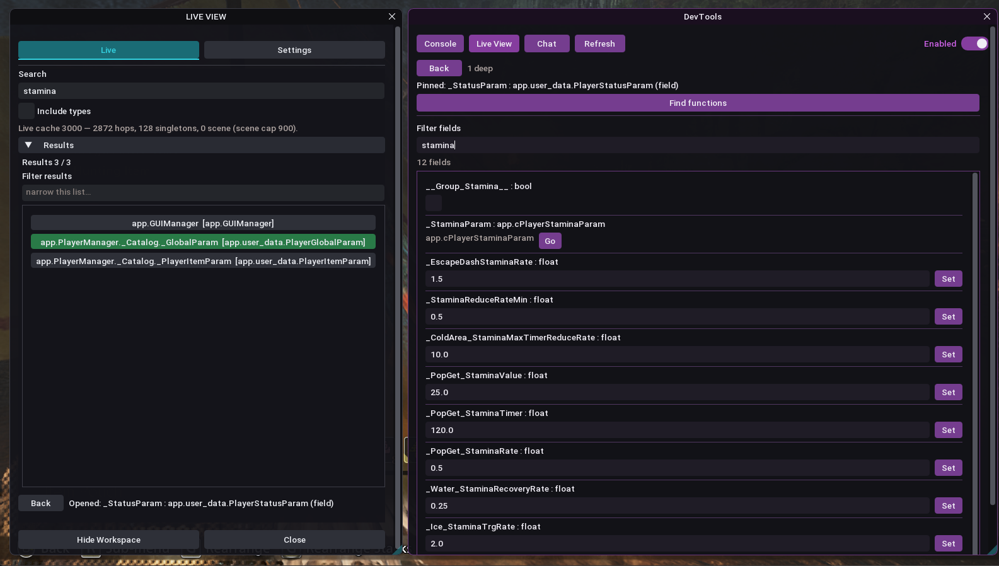
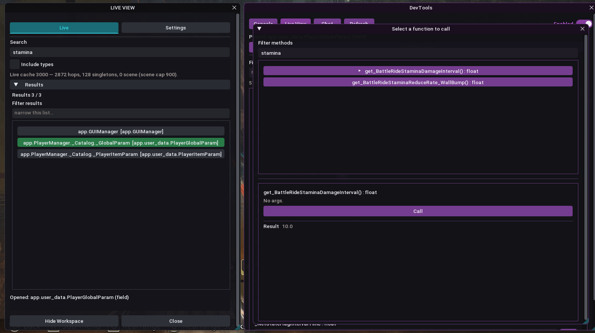
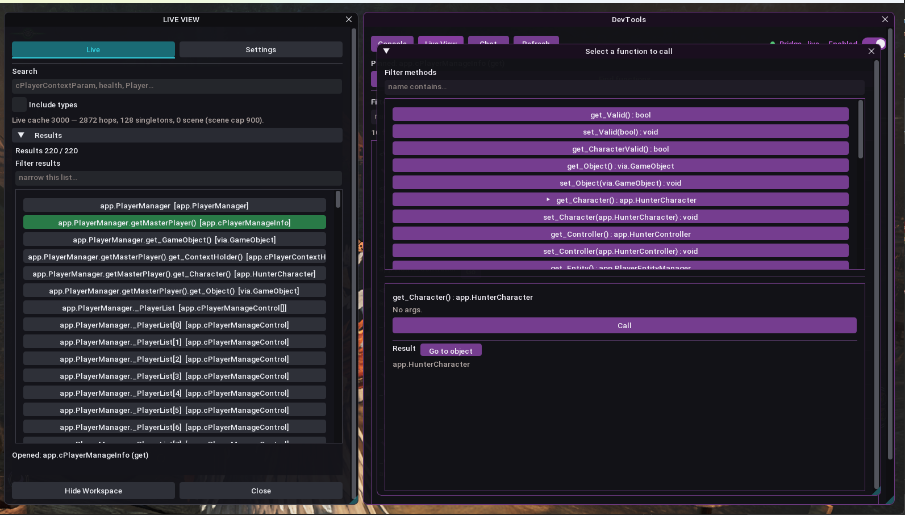
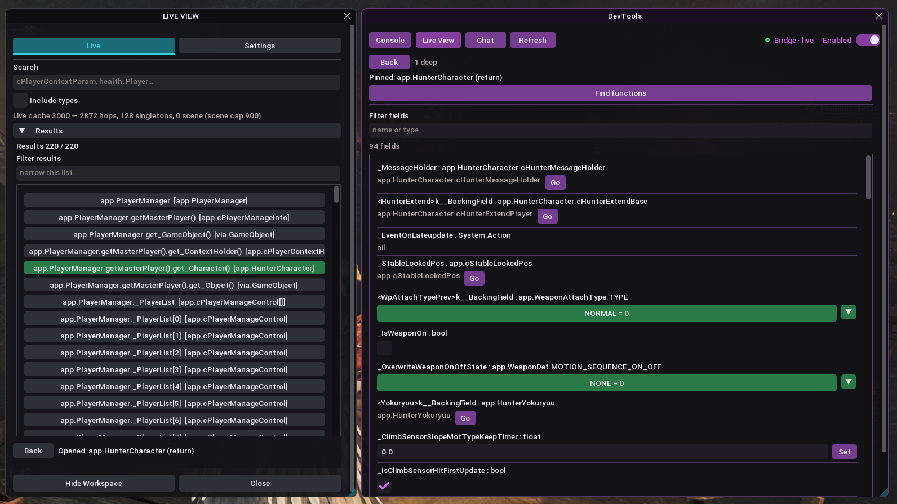

# Live View, from the shots

These are Monster Hunter Wilds frames. F8 is open. The left list is the live cache — hop paths off `PlayerManager`, not a TDB dump. The right side is DevTools. Chat and MCP read the same opened object you see here.

The loop the shots show: **find → open → read (or ask) → call → go.**

## Chat sees the pinned object

Search `stamina`. Click `_StatusParam` (`app.user_data.PlayerStatusParam`). Ask Chat what it sees.

The reply is live fields: `_BaseMaxHealth`, `_StaminaParam`, pop-get bonuses, gunner defence. That is the rare bit — the conversation is on the managed object in the world, not a string search over a dump.

Finder still owns navigation. Chat is a second set of eyes on whatever you opened.

## Inspect and Set

Same object, Live View tab. Filter `stamina`. Floats get **Set**. `_StaminaParam` is another object — **Go** hops into it.

Writes stay on this overlay. MCP is read-only. Chat can Set primitives on the opened object.

## Call a getter, get a number

**Find functions** on `app.user_data.PlayerGlobalParam`. Filter `stamina`, call `get_BattleRideStaminaDamageInterval()`. Result: `10.0`.

That is a live method return, not a field peek. Useful when the interesting value is behind a getter.

## Call a getter, get an object

Opened `cPlayerManageInfo` from `PlayerManager.getMasterPlayer()`. Call `get_Character()` — no args — result `app.HunterCharacter`. **Go to object** pins that instance and opens inspect.

This is how you walk the graph when the next object is a return value, not a field.

## Land on the instance

After Go: `app.HunterCharacter` is opened, 94 fields, enums and child objects with their own **Go**. The Finder row updates to the same hop. You can keep calling from here.

That is the explorer: you did not start from a type name in Object Explorer. You started from a live player hop and followed it.

---

Back to the [README](README.md).
