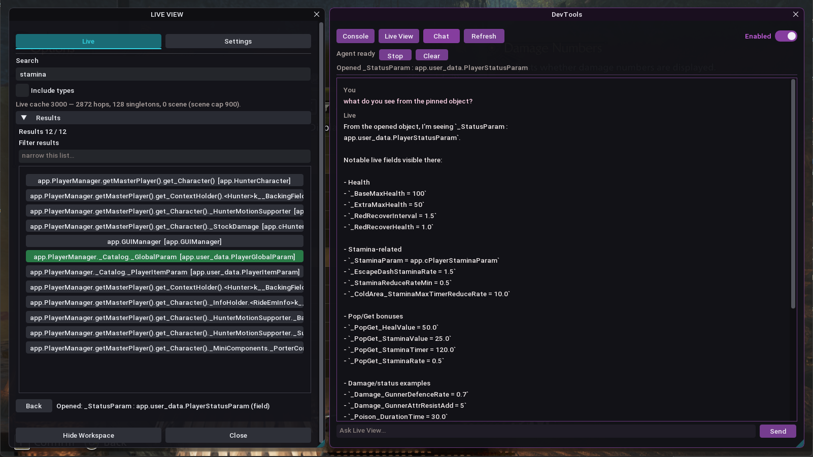

# REFramework Tools

Live object explorer for [RE Engine](https://github.com/praydog/REFramework) games. Search what is in the world, inspect fields, call methods, and ask Chat about the object you have open.

[](DEMO.md)

Finder on the left. DevTools on the right. That Chat reply is live fields on `_StatusParam`, not a dump. [Walk through the shots →](DEMO.md)

**F8** toggles Live View. Game QoL menus stay on **~** in sibling [REFrameworkMods](../REFrameworkMods). This overlay does not include cheats.

The explorer is the product. Chat and **MCP** are accelerators: you find an object in-game, an agent (in the overlay or in Cursor) verifies the live name and fields, you write a mod from that graph — not from an IL2CPP dump search.

```
REFrameworkLiveView/          finder / inspect / call / Chat (Lua + plugins)
ReFrameworkLiveView.Agent/    Azure sidecar + Chat + MCP on 3002
GithubAssets/                 README + DEMO shots
ref_cursor/                   cursor-lock plugin
ref_live/                     live-object plugin
```

The C++ for `ref_cursor` and `ref_live` still builds in the **REFramework** fork. Folders here are the Lua product and the READMEs.

## Live View

Needs sibling Mods for window chrome:

```
cd REFrameworkLiveView
npm run bundle
npm run deploy
```

Bundle reads `../../REFrameworkMods/REFrameworkRefShell` (or `REFSHELL_DIR`). Deploy writes:

```
<game>/reframework/autorun/ref_liveview.lua
<game>/reframework/plugins/ref_cursor.dll
<game>/reframework/plugins/ref_live.dll
```

**Refresh** rebuilds the live cache. After a Lua deploy, overlay **Reset scripts**. After a new DLL, close the game first.

Deploy detail: [REFrameworkLiveView/README.md](REFrameworkLiveView/README.md).

## Agent

One local process: in-game Chat, the file bridge, and MCP. The game never holds the API key. `.env` stays on disk and is gitignored.

```
cd ReFrameworkLiveView.Agent
python -m backend install
liveview-agent start -game MonsterHunterWilds
```

DevTools Chat **Start** / **Stop** spawn the same `liveview-agent` binary. Health: `GET http://127.0.0.1:3002/api/health`. Install detail is in [ReFrameworkLiveView.Agent/README.md](ReFrameworkLiveView.Agent/README.md).

### MCP

[Model Context Protocol](https://modelcontextprotocol.io) is how Cursor (and other clients) call tools. This repo exposes a **read-only Live View MCP** at `http://127.0.0.1:3002/mcp` on that same sidecar — not a second server, not a second port.

Point Cursor at it once. Command Palette → **View: Open MCP Settings** (not the usual settings UI). That file is `%USERPROFILE%\.cursor\mcp.json`:

```json
{
  "mcpServers": {
    "liveview": {
      "url": "http://127.0.0.1:3002/mcp"
    }
  }
}
```

Green `liveview` means this chat can call tools. It does not mean the game is live. Tools need F8 open and the game writing a heartbeat (`hb.json`). The header **Bridge** chip is the AND of both pulses — click it if Chat or Cursor says stale.

| | Chat (in-game) | MCP (Cursor) |
| --- | --- | --- |
| Search the live cache | yes | yes |
| Open a row (same as a Finder click) | yes | yes |
| Read fields on the opened object | yes | yes |
| Set bool / number / string on the opened object | yes | **no** |
| Call methods | no | no |

MCP stays read-only on purpose. Writes stay in the overlay, on an object you can see. Both share one `req.json` — do not Chat-tool and Cursor-tool at the same time.

Read tools: `bridge_status`, `ui_state`, `cache_stats`, `cache_search`, `search_types`, `open_object`, `inspect_opened`.

Empty Finder means empty MCP. Same live cache as Finder (cap 8000). Another game: `liveview-agent stop` then `start -game <folder>`, or **Start** from Chat in that session.

Do not commit `.venv/` or `.env`.